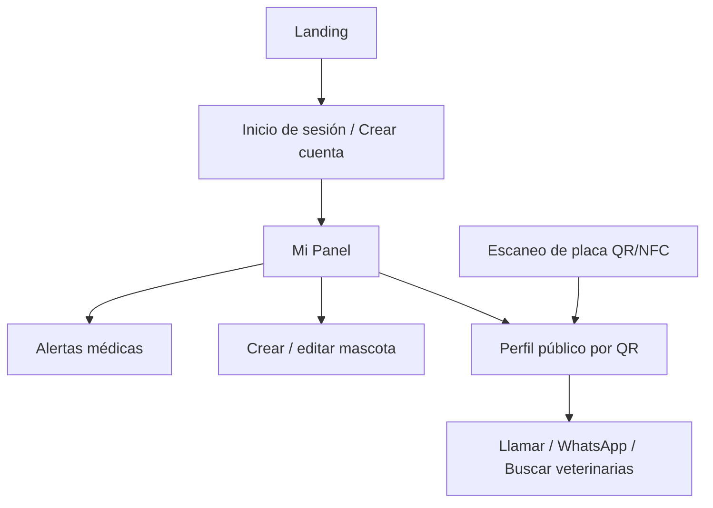

# Arquitectura

Última revisión: 2026-10-09

## Visión general

```
Navegador (celular o computador)
   │
   ├── Frontend estático: HTML + CSS + JavaScript   ← hoy, publicado en Netlify
   │       └── datos simulados en localStorage
   │
   └── API REST (FastAPI)  ← Fase B, aún no conectada
           └── Base de datos (SQLite en desarrollo, PostgreSQL en producción)
```

Mientras no exista el backend, el frontend guarda sus datos en el navegador de cada persona. Cuando exista la API, solo se cambia la forma de leer y guardar los datos; las pantallas no cambian.

## Flujo de usuario



Hay un recorrido público (landing, artículos y perfil por QR, sin cuenta) y uno privado (panel y alertas, con sesión). Falta la pantalla "Perfil de la mascota" para conectar el panel con el detalle de cada mascota; hoy "Ver perfil" lleva al perfil público de ejemplo.

## Pantallas y datos que usan

| Pantalla | Lee | Escribe |
|---|---|---|
| Landing y artículos | Nada (contenido fijo) | Nada |
| Inicio de sesión | Nada | `sp_usuario` (al entrar con `demo` / `demo`) |
| Mi Panel | `SP_PETS2`, `SP_ALERTAS` | `SP_PETS2`, `SP_ALERTAS` (datos de ejemplo la primera vez), `SP_PET_VISTA` |
| Alertas médicas | `SP_ALERTAS`, `SP_PETS2` | `SP_ALERTAS` |
| Perfil público por QR | Nada (datos de Fiodor escritos en la página) | `sp_usuario` (el botón "Entrar al Panel" no valida credenciales) |

## Datos simulados (localStorage)

| Clave | Contenido |
|---|---|
| `sp_usuario` | Sesión de prueba. Existe si se inició sesión con `demo` / `demo` |
| `SP_PETS2` | Lista de mascotas |
| `SP_ALERTAS` | Lista de alertas médicas |
| `SP_PET_VISTA` | Id de la última mascota a la que se le pulsó "Ver perfil" |

**Mascota** (`SP_PETS2`): `id`, `nombre`, `especie` (Perro o Gato), `raza`, `edad` (texto), `color`, `peso`, `estado` (`normal` o `perdida`), `foto` (imagen JPEG reducida a 800 px, guardada como texto), `alergias`, `vacunas`, `vet`, `vetTel`, `vetDir`, `emNombre`, `emTel`, `notas`.

**Alerta** (`SP_ALERTAS`): `id`, `mascota` (nombre en texto), `tipo` (Vacuna, Desparasitación, Control veterinario, Medicamento, Baño y peluquería u Otro), `desc`, `fecha` (`AAAA-MM-DD`), `recordar` (días de aviso), `notas`.

**Estado de una alerta** (calculado, no se guarda): `danger` si la fecha ya pasó, `warn` si vence hoy o dentro de los días de aviso, `ok` en los demás casos.

## Módulos compartidos

| Archivo | Para qué sirve |
|---|---|
| `css/variables.css` | Colores, sombras, radios, espacios y tipografía |
| `css/base.css` | Estilos base del perfil QR |
| `css/landing.css`, `css/qr-perfil.css` | Estilos de cada pantalla |
| `css/icons.css` y `js/icons.js` | Conjunto de íconos SVG |
| `js/utils.js` | `esc()`, `leerLS()`, `parseFecha()`, `fechaRelativa()`, `calcularEstadoAlerta()`, `alertasDemo()` |

La landing y el perfil QR ya usan estos archivos compartidos. El login, el panel, las alertas y los artículos solo cargan `icons.css`: el resto de sus estilos y sus variables están dentro de cada página, en su propio bloque `<style>`.

## Base de datos (paso 1 del backend)

Creada con SQLAlchemy. **Todavía no está en este repositorio** y es un modelo mínimo.

```
users 1 ──< N pets 1 ──< N medical_alerts
```

| Tabla | Campos |
|---|---|
| `users` | `id`, `name`, `email` (único), `password_hash`, `phone`, `created_at` |
| `pets` | `id`, `owner_id`, `name`, `species`, `breed`, `birth_date`, `photo_url`, `notes`, `public_code` (único, código aleatorio de la URL del QR), `is_lost`, `created_at` |
| `medical_alerts` | `id`, `pet_id`, `kind`, `title`, `description`, `created_at` |

### Diferencias con lo que ya maneja el frontend

Antes de conectar, hay que alinear el modelo con los datos reales de las pantallas:

| Dato del frontend | En la base de datos | Qué hacer |
|---|---|---|
| Alerta: `fecha` | No existe | **Agregar** (es el dato central de las alertas) |
| Alerta: `recordar` (días) | No existe | **Agregar** |
| Alerta: `notas` | No existe | Agregar o unir con `description` |
| Alerta: `mascota` (por nombre) | `pet_id` | Cambiar el vínculo a `pet_id` |
| Alerta: sin título | `title` obligatorio | Generar desde `tipo` y `desc`, o hacerlo opcional |
| Mascota: `color`, `peso` | No existen | Agregar |
| Mascota: `alergias`, `vacunas` | No existen | Agregar |
| Mascota: `vet`, `vetTel`, `vetDir` | No existen | Agregar |
| Mascota: `emNombre`, `emTel` | No existen | Agregar |
| Mascota: `edad` (texto) | `birth_date` (fecha) | Decidir cuál se usa |
| Mascota: `especie` ("Perro") | `species` ("perro") | Normalizar los valores |
| Mascota: `foto` (texto en base64) | `photo_url` (ruta) | Guardar archivo y su ruta |
| Registro: nombre, apellido, cédula, nacimiento | `name`, sin los demás | El formulario no pide correo ni contraseña, y la base sí los necesita |

## Privacidad y seguridad (reglas del proyecto)

- El perfil público muestra solo lo que el dueño decida compartir. **Hoy no existe esa opción.**
- No guardar contraseñas en texto plano (se usará hash) ni claves en el código.
- Validar todas las entradas.
- Todo dato que se inserte como HTML pasa por `esc()` para evitar código inyectado.
